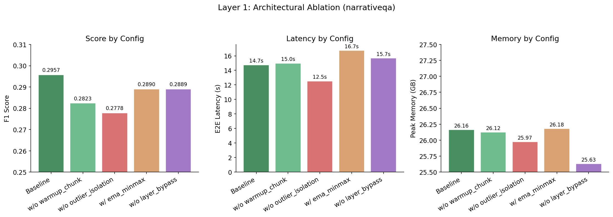
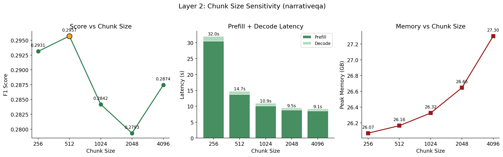
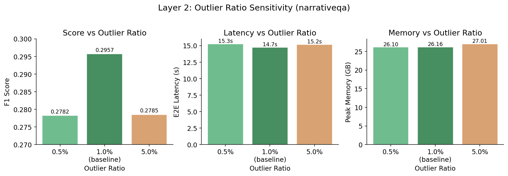
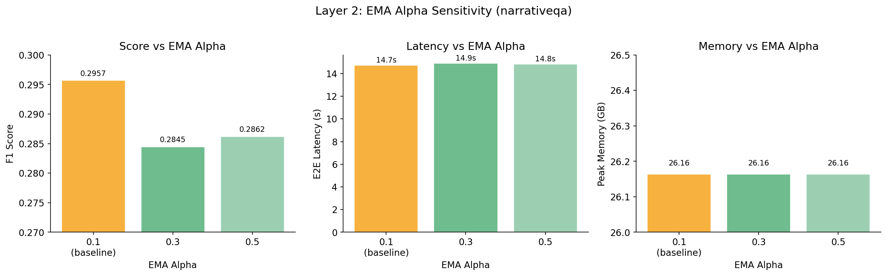
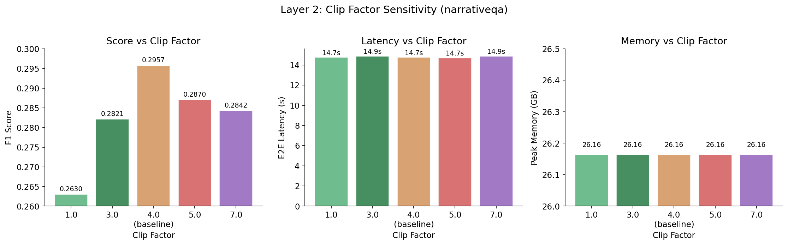
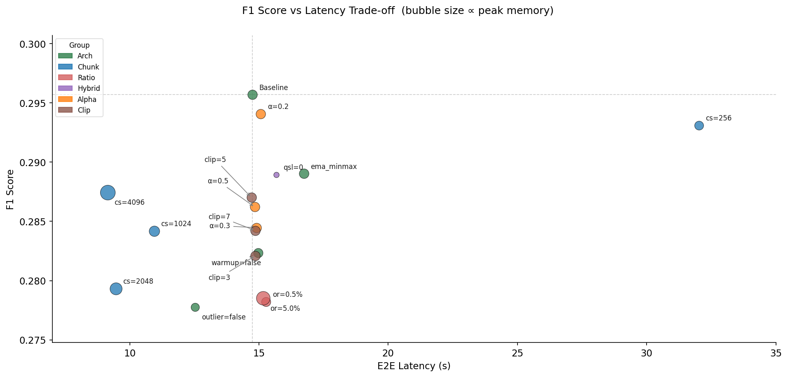

# Ablation Studies — LiveKVQuantP

> **Model**: meta-llama/Meta-Llama-3.1-8B-Instruct
> **Task**: narrativeqa (LongBench v1, all samples)
> **Baseline**: INT4, chunk_size=512, ema_alpha=0.1, clip_factor=4.0, outlier_ratio=1%, use_warmup=True, use_outlier_isolation=True, stats_method=ema_absmax
> **Figures** generated by [`ablation_studies.ipynb`](ablation_studies.ipynb)

---

## 1. Architectural Ablation (Layer 1)

Each experiment removes or swaps exactly one component from the baseline, isolating its contribution.

| Config | use_warmup | use_outlier | stats_method | Score | Δ Score | E2E (s) | Prefill (s) | Decode (s) | Mem (GB) |
|--------|:---------:|:-----------:|:------------:|------:|--------:|--------:|------------:|-----------:|---------:|
| **Baseline** | true | true | ema_absmax | **0.2957** | — | 14.7 | 13.8 | 1.0 | 26.2 |
| warmup=false | false | true | ema_absmax | 0.2938 | -0.0019 | 15.1 | 14.1 | 1.0 | 26.1 |
| outlier=false | true | false | ema_absmax | 0.2733 | -0.0224 | 13.0 | 12.0 | 0.9 | 26.0 |
| ema_minmax | true | true | ema_minmax | 0.2725 | -0.0232 | 16.6 | 15.6 | 1.0 | 26.2 |

### Analysis

- **Warmup** (首個 chunk 不量化) 影響極小 (Δ = -0.0019)。從 score 角度幾乎可以移除，但保留 warmup 幾乎不增加任何成本，作為安全邊際仍值得保留。
- **Outlier Isolation** 是最關鍵的元件。移除後 score 下降 7.6% (-0.0224)，顯示將 outlier 值以 FP16 稀疏方式分離儲存，對量化精度有顯著保護作用。同時 latency 下降 12% (14.7s → 13.0s)，因為省去了 outlier 分離的計算開銷，但這個 speed-up 不值得 score 的代價。
- **EMA MinMax** (asymmetric quantization) 表現最差 (Δ = -0.0232)，且 latency 反而增加 13% (需要追蹤 min 和 max 兩個統計量)。Symmetric quantization (ema_absmax) 明顯優於 asymmetric，因為 absmax 只需一個統計量、更新更穩定，且 KV cache 的 value 分布本身接近對稱。

---

## 2. Chunk Size Sensitivity (Layer 2)

Chunk size 決定每次量化的 token 數量，直接影響量化粒度與計算效率之間的 trade-off。

| Chunk Size | Score | Δ Score | E2E (s) | Prefill (s) | Decode (s) | Mem (GB) |
|-----------:|------:|--------:|--------:|------------:|-----------:|---------:|
| 256 | 0.2929 | -0.0028 | 30.6 | 29.1 | 1.5 | 26.1 |
| **512** | **0.2957** | — | **14.7** | 13.8 | 1.0 | 26.2 |
| 1024 | 0.2760 | -0.0197 | 11.4 | 10.6 | 0.8 | 26.3 |
| 2048 | 0.2776 | -0.0181 | 10.0 | 9.3 | 0.7 | 26.6 |
| 4096 | 0.2935 | -0.0022 | 9.7 | 9.0 | 0.7 | 27.3 |

### Analysis

- **Score 呈現 U 型曲線**：512 和 4096 兩端 score 最高 (0.2957, 0.2935)，中間 1024–2048 反而下降。這暗示 chunk 粒度並非單調影響 — 過小增加 boundary effect，過大則降低 EMA 統計更新頻率，兩者各有不同的退化機制。
- **Latency 隨 chunk size 單調下降**：256 → 4096 的 E2E 從 30.6s 降至 9.7s (3.2× speed-up)。原因是大 chunk 減少了量化 kernel 的調用次數，amortize 了 kernel launch overhead。
- **Memory 隨 chunk size 單調上升**：因為較大 chunk 在量化前需要暫存更多 FP16 token，peak memory 從 26.1 GB 升至 27.3 GB (+1.2 GB)。
- **最佳平衡點為 512**：score 最高且 memory 低。若以 latency 為優先，chunk_size=4096 可達 9.7s 且 score 僅下降 0.0022 (-0.7%)，是一個合理的 speed-oriented 替代方案。

---

## 3. Outlier Ratio Sensitivity (Layer 2)

Outlier ratio 控制以 FP16 稀疏方式保留的 outlier 比例。

> 注意：以下兩個非 baseline 實驗同時使用了 quant_start_layer=3（前 3 層保留 FP16），而 baseline 為 None。

| Outlier Ratio | Score | Δ Score | E2E (s) | Prefill (s) | Decode (s) | Mem (GB) |
|--------------:|------:|--------:|--------:|------------:|-----------:|---------:|
| 0.5% | 0.2810 | -0.0147 | 14.8 | 13.8 | 1.0 | 26.1 |
| **1.0%** | **0.2957** | — | **14.7** | 13.8 | 1.0 | **26.2** |
| 5.0% | 0.2825 | -0.0132 | 14.9 | 13.9 | 1.0 | 27.0 |

### Analysis

- **1% 是 sweet spot**：0.5% 不足以捕捉所有關鍵 outlier (score -5.0%)，5% 過多反而引入雜訊且增加 memory (+0.8 GB) 但 score 仍然低於 1%。
- **Latency 差異不大** (14.7–14.9s)：outlier 的稀疏儲存開銷相對於 dense quantization 的開銷很小，比例變化不顯著影響速度。
- **Memory 在 5% 時明顯上升**：因為更多 value 以 FP16 稀疏格式儲存而非 INT4 dense 格式，memory 從 26.2 GB 升至 27.0 GB。
- 值得注意的是，這兩個實驗同時改變了 quant_start_layer (3 vs None)，因此 score 差異可能部分來自 hybrid precision 的影響（見下節）。

---

## 4. Hybrid Precision — quant_start_layer (Layer 2)

測試是否跳過前 N 層不量化（保留 FP16）能改善精度。

| quant_start_layer | Score | Δ Score | E2E (s) | Prefill (s) | Decode (s) | Mem (GB) |
|:-----------------:|------:|--------:|--------:|------------:|-----------:|---------:|
| 0 (全層量化) | 0.2846 | -0.0111 | 15.3 | 14.2 | 1.0 | 25.6 |
| **None (baseline)** | **0.2957** | — | **14.7** | 13.8 | 1.0 | **26.2** |

### Analysis

- **全層量化 (layer 0 開始) 造成 3.8% score 下降**：前幾層的 attention 對 positional encoding 和 global context 的建立至關重要，量化損失在此放大。
- **Memory 節省 0.6 GB** (26.2 → 25.6 GB)：因為不再保留任何層的 FP16 KV cache。
- **Latency 幾乎不變**：量化層數增加但每層的量化開銷相同，且前幾層的 FP16 → INT4 轉換成本被 amortize。
- 結論：保留前幾層不量化 (baseline 的 None 設定) 是值得的 — 0.6 GB 的 memory 節省不足以彌補 3.8% 的 score 損失。

---

## 5. EMA Alpha Sensitivity (Layer 2)

EMA alpha 控制量化統計量（absmax）的指數移動平均更新速率。較小的 alpha 更加「記住歷史」，較大的 alpha 更快追蹤最新 chunk 的統計。

> 所有實驗使用 quant_start_layer=3（前 3 層保留 FP16）。

| ema_alpha | Score | Δ Score | E2E (s) | Prefill (s) | Decode (s) | Mem (GB) |
|----------:|------:|--------:|--------:|------------:|-----------:|---------:|
| **0.1 (baseline)** | **0.2957** | — | 14.7 | 13.8 | 1.0 | 26.2 |
| 0.2 | 0.2941 | -0.0016 | 15.1 | 14.1 | 1.0 | 26.2 |
| 0.3 | 0.2845 | -0.0112 | 14.9 | 13.9 | 1.0 | 26.2 |
| 0.5 | 0.2862 | -0.0095 | 14.8 | 13.8 | 1.0 | 26.2 |

### Analysis

- **alpha=0.1 是最佳 score (0.2957)**。較慢的 EMA 更新讓統計量更穩定，避免因單一 chunk 的極端值造成 scale 劇烈波動。
- **alpha ≥ 0.3 後 score 下降明顯** (-0.0095 ~ -0.0112)：更新過快導致 scale 受短期波動干擾，量化 error 增大。
- **Latency 和 Memory 完全不受 alpha 影響**：alpha 僅影響一個純量的 EMA 更新，計算成本可忽略。
- 結論：alpha=0.1 是最佳預設值，alpha 不宜超過 0.2。

---

## 6. Clip Factor Sensitivity (Layer 2)

Clip factor 控制量化前的 outlier clipping 範圍：value 超過 `clip_factor × scale` 的部分會被截斷。較小的值 clip 更積極，較大的值保留更多極端值。

> 所有實驗使用 quant_start_layer=3（前 3 層保留 FP16）。

| clip_factor | Score | Δ Score | E2E (s) | Prefill (s) | Decode (s) | Mem (GB) |
|------------:|------:|--------:|--------:|------------:|-----------:|---------:|
| 3.0 | 0.2948 | -0.0009 | 14.9 | 13.9 | 1.0 | 26.2 |
| **4.0 (baseline)** | **0.2957** | — | **14.7** | 13.8 | 1.0 | **26.2** |
| 5.0 | 0.2862 | -0.0095 | 14.9 | 13.9 | 1.0 | 26.2 |
| 7.0 | 0.2795 | -0.0162 | 14.9 | 13.9 | 1.0 | 26.2 |

### Analysis

- **Score 隨 clip_factor 增大而下降**：clip=4.0 最高 (0.2957)，clip=7.0 最低 (0.2795, -5.5%)。較大的 clip range 意味著量化的 dynamic range 被少數極端值拉大，多數正常值被壓縮到更少的 quantization bin 裡，精度下降。
- **clip=3.0 接近 baseline** (-0.0009)，更積極的 clipping 搭配 outlier isolation（已經分離了極端值）可以讓 dense quantization 的 range 更緊湊。
- **Latency 和 Memory 不受影響**：clipping 是逐元素的簡單 operation，成本可忽略。
- 結論：clip_factor=3.0~4.0 是合理範圍，不宜超過 5.0。

---

## 7. Score–Latency–Memory Trade-off

此散點圖綜合呈現所有 17 組實驗的三維 trade-off：
- **X 軸**：E2E latency (越左越快)
- **Y 軸**：Score (越高越好)
- **Bubble 大小**：Peak memory (越小越省)

**Pareto 最優配置**：
- **最高 score**：Baseline α=0.1 (0.2957, 14.7s, 26.2 GB) — score 最高，latency 合理
- **最低 latency**：chunk_size=4096 (0.2935, 9.7s, 27.3 GB) — 犧牲 0.7% score 換取 34% speed-up
- **最低 memory**：quant_start_layer=0 (0.2846, 15.3s, 25.6 GB) — 犧牲 3.8% score 換取 0.6 GB

---

## 8. Key Takeaways

| Finding | Impact | Recommendation |
|---------|--------|----------------|
| Outlier isolation 是最關鍵元件 | 移除 → score -7.6% | 必須保留 |
| EMA absmax (symmetric) 優於 minmax (asymmetric) | minmax → score -7.8%, latency +13% | 採用 ema_absmax |
| Warmup 影響可忽略 | Δ = -0.0019 | 保留（成本為零，作為安全邊際） |
| chunk_size=512 是最佳 score 配置 | 最高 score，latency 合理 | 預設值 |
| chunk_size=4096 適合 latency-first 場景 | score -0.7%, latency -34% | 可作為 fast mode |
| outlier_ratio=1% 為 sweet spot | 0.5%/5% 均下降 | 預設值 |
| 前幾層保留 FP16 值得 | 全量化 → score -3.8%, 僅省 0.6 GB | 保留預設 |
| ema_alpha=0.1 是最佳 | alpha 越大 score 越低 | 預設值 |
| clip_factor 不宜超過 5.0 | clip=7.0 → score -5.5% | 維持 3.0~4.0 |
