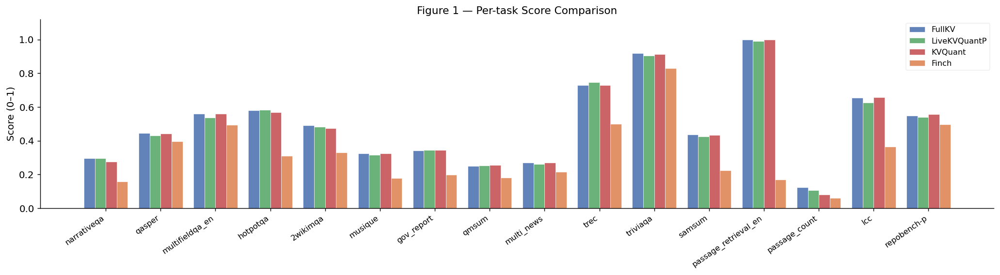
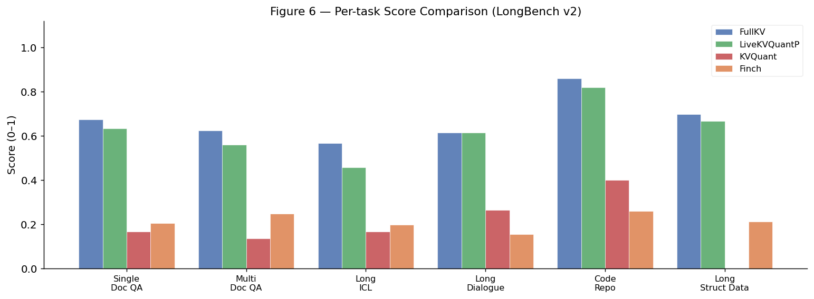
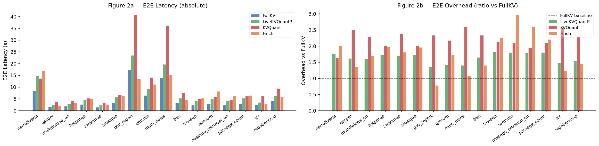
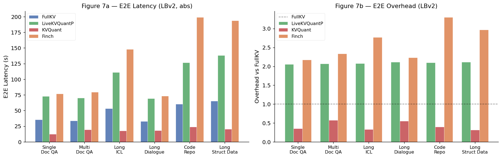
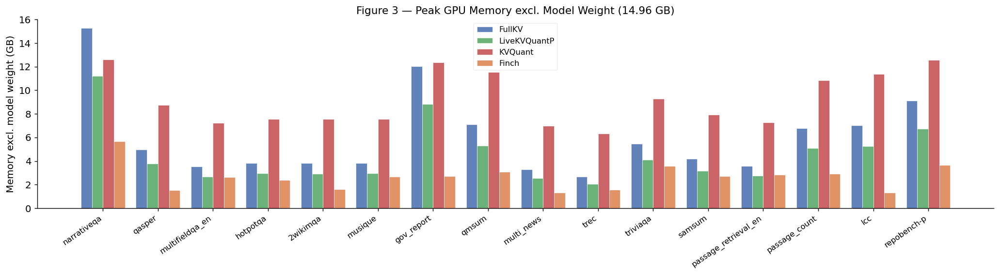
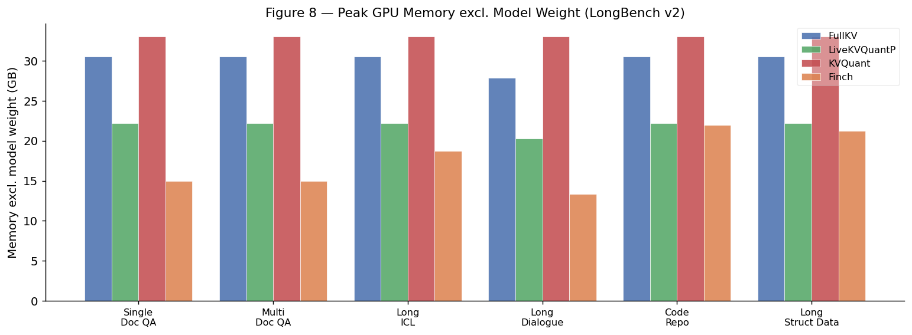
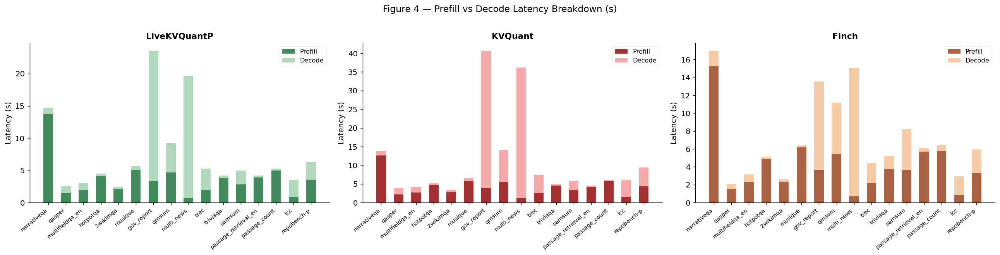
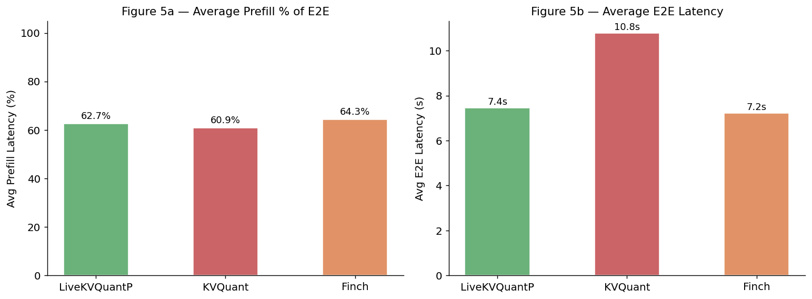
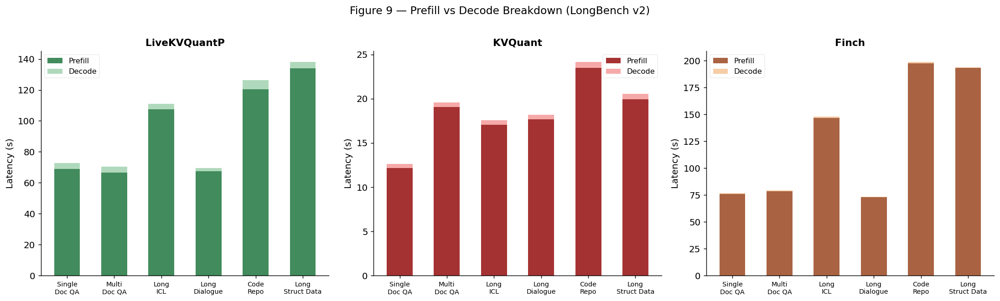
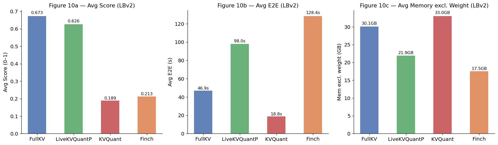

# KV Cache Compression — Comparison on LongBench v1 & v2

> **Model**: meta-llama/Meta-Llama-3.1-8B-Instruct
> **Figures** generated by [`main_result_comparison.ipynb`](main_result_comparison.ipynb)

| Method | Description |
|--------|-------------|
| **FullKV** | FP16 full KV cache — baseline |
| **LiveKVQuantP** | Chunk-wise online INT4 quantisation + outlier isolation (ema_alpha=0.1) |
| **KVQuant** | Offline INT4 static quantisation via CUDA kernels |
| **Finch** | Attention-score based token dropping, GQA-aware per-head vote, split_size=512 |

> ⚠️ **Note on KVQuant v2**: KVQuant pre-allocates a static 32 768-token KV buffer.
> LongBench v2 inputs routinely exceed 32 k tokens, causing OOM during prefill.
> Affected samples score 0 and their latency reflects only the failed prefill attempt.
> Peak memory is clamped at 48 GB (GPU limit).

---

## 1. Accuracy (Score)

### LongBench v1 — 16 tasks, 200 samples each

**Table 1 — Score (0–1). Δ = method − FullKV.**

| Task | FullKV | LiveKVQuantP | Δ | KVQuant | Δ | Finch | Δ |
|------|-------:|-------------:|--:|--------:|--:|------:|--:|
| narrativeqa | 0.2950 | 0.2957 | +0.0007 | 0.2761 | -0.0189 | 0.1566 | -0.1384 |
| qasper | 0.4457 | 0.4294 | -0.0163 | 0.4411 | -0.0046 | 0.3966 | -0.0491 |
| multifieldqa_en | 0.5596 | 0.5375 | -0.0221 | 0.5609 | +0.0013 | 0.4934 | -0.0662 |
| hotpotqa | 0.5795 | 0.5815 | +0.0020 | 0.5680 | -0.0115 | 0.3094 | -0.2701 |
| 2wikimqa | 0.4909 | 0.4822 | -0.0087 | 0.4735 | -0.0175 | 0.3289 | -0.1620 |
| musique | 0.3255 | 0.3170 | -0.0085 | 0.3243 | -0.0012 | 0.1786 | -0.1469 |
| gov_report | 0.3430 | 0.3444 | +0.0014 | 0.3450 | +0.0020 | 0.1991 | -0.1439 |
| qmsum | 0.2512 | 0.2537 | +0.0025 | 0.2555 | +0.0043 | 0.1823 | -0.0689 |
| multi_news | 0.2692 | 0.2625 | -0.0067 | 0.2701 | +0.0010 | 0.2143 | -0.0549 |
| trec | 0.7300 | 0.7450 | +0.0150 | 0.7300 | +0.0000 | 0.5000 | -0.2300 |
| triviaqa | 0.9173 | 0.9049 | -0.0124 | 0.9115 | -0.0058 | 0.8291 | -0.0882 |
| samsum | 0.4375 | 0.4261 | -0.0114 | 0.4345 | -0.0030 | 0.2227 | -0.2148 |
| passage_retrieval_en | 1.0000 | 0.9900 | -0.0100 | 1.0000 | +0.0000 | 0.1700 | -0.8300 |
| passage_count | 0.1250 | 0.1050 | -0.0200 | 0.0800 | -0.0450 | 0.0595 | -0.0655 |
| lcc | 0.6533 | 0.6268 | -0.0265 | 0.6586 | +0.0053 | 0.3650 | -0.2883 |
| repobench-p | 0.5475 | 0.5387 | -0.0088 | 0.5565 | +0.0091 | 0.4970 | -0.0505 |
| **Average** | **0.4981** | **0.4900** | **-0.0081** | **0.4929** | **-0.0053** | **0.3189** | **-0.1792** |

#### Why does Finch score significantly lower on v1?

Finch permanently **drops** KV cache entries judged unimportant by attention scores.
Two structural mismatches with Llama 3.1 8B make this selection unreliable:

| Root cause | Detail |
|-----------|--------|
| **GQA weakens voting signal** | Llama 3.1 uses GQA with only **8 KV heads** (vs. 32 in MHA Llama 2). Importance votes are averaged across far fewer independent heads → noisier, less reliable token selection. |
| **Large RoPE θ flattens attention** | Llama 3.1 sets RoPE θ = **500 k** (vs. 10 k in Llama 2). Attention weights are spread more uniformly over long distances, making high-attention tokens much harder to distinguish from low-attention ones. |
| **Iterative compression error accumulation** | Context is split into 512-token chunks. Each chunk discards tokens that later chunks may still require, and errors compound toward the end of long documents. |

Tasks most affected: **passage_retrieval_en** (Δ = −0.83), **hotpotqa** (−0.27),
**triviaqa** (−0.08) — all require locating a precise span scattered across a long context.

---

### LongBench v2 — 6 task categories, multiple-choice accuracy

**Table 2 — Score (0–1). Δ = method − FullKV.**

| Task | FullKV | LiveKVQuantP | Δ LKP | KVQuant | Δ KVQ | Finch | Δ Finch |
|------|-------:|-------------:|------:|--------:|------:|------:|--------:|
| Single-Document QA | 0.6743 | 0.6343 | −0.0400 | 0.1657 | −0.5086 | 0.2057 | −0.4686 |
| Multi-Document QA | 0.6240 | 0.5600 | −0.0640 | 0.1360 | −0.4880 | 0.2480 | −0.3760 |
| Long In-context Learning | 0.5679 | 0.4568 | −0.1111 | 0.1667 | −0.4012 | 0.1975 | −0.3704 |
| Long-dialogue History | 0.6154 | 0.6154 | 0.0000 | 0.2632 | −0.3522 | 0.1538 | −0.4616 |
| Code Repository Understanding | 0.8600 | 0.8200 | −0.0400 | 0.4000 | −0.4600 | 0.2600 | −0.6000 |
| Long Structured Data | 0.6970 | 0.6667 | −0.0303 | 0.0000 | −0.6970 | 0.2121 | −0.4849 |
| **Average** | **0.6731** | **0.6255** | **−0.0476** | **0.1886** | **−0.4845** | **0.2128** | **−0.4602** |

#### Why do KVQuant and Finch score very low on v2?

| Method | Root cause |
|--------|-----------|
| **KVQuant** | Static `maxseqlen = 32 768` buffer → inputs > 32 k tokens cause `OOM(prefill)`. Samples score 0 and inflate peak memory to GPU limit (48 GB). |
| **Finch** | Token-dropping with 512-token split_size. v2's very long inputs force Finch to discard an extreme fraction of context → critical information is lost before the question is reached. |

**LiveKVQuantP** generalises to v2 because it uses dynamic chunk-wise INT4 allocation (no static buffer OOM) and retains all tokens (quantised, not dropped), preserving the full context at reduced precision.

---

## 2. End-to-End Latency

### LongBench v1

**Table 3 — E2E Latency (ms) and overhead ratio vs FullKV.**

| Task | FullKV (ms) | LiveKVQuantP (ms) | Overhead | KVQuant (ms) | Overhead | Finch (ms) | Overhead |
|------|------------:|------------------:|---------:|-------------:|---------:|-----------:|---------:|
| narrativeqa | 8,429 | 14,745 | 1.75× | 13,726 | 1.63× | 16,979 | 2.01× |
| qasper | 1,559 | 2,519 | 1.62× | 3,886 | 2.49× | 2,101 | 1.35× |
| multifieldqa_en | 1,853 | 2,978 | 1.61× | 4,231 | 2.28× | 3,155 | 1.70× |
| hotpotqa | 2,600 | 4,512 | 1.74× | 5,220 | 2.01× | 5,146 | 1.98× |
| 2wikimqa | 1,444 | 2,459 | 1.70× | 3,425 | 2.37× | 2,610 | 1.81× |
| musique | 3,267 | 5,659 | 1.73× | 6,558 | 2.01× | 6,398 | 1.96× |
| gov_report | 17,394 | 23,535 | 1.35× | 40,643 | 2.34× | 13,550 | 0.78× |
| qmsum | 6,469 | 9,236 | 1.43× | 14,079 | 2.18× | 11,185 | 1.73× |
| multi_news | 13,967 | 19,632 | 1.41× | 36,231 | 2.59× | 15,073 | 1.08× |
| trec | 3,186 | 5,249 | 1.65× | 7,444 | 2.34× | 4,462 | 1.40× |
| triviaqa | 2,310 | 4,213 | 1.82× | 4,907 | 2.12× | 5,232 | 2.26× |
| samsum | 2,779 | 5,002 | 1.80× | 5,849 | 2.10× | 8,228 | 2.96× |
| passage_retrieval_en | 2,351 | 4,217 | 1.79× | 4,590 | 1.95× | 6,125 | 2.61× |
| passage_count | 2,925 | 5,268 | 1.80× | 6,157 | 2.10× | 6,456 | 2.21× |
| lcc | 2,397 | 3,535 | 1.47× | 6,131 | 2.56× | 2,960 | 1.24× |
| repobench-p | 4,121 | 6,323 | 1.53× | 9,417 | 2.28× | 5,948 | 1.44× |
| **Average** | **4,816** | **7,443** | **1.63×** | **10,781** | **2.21×** | **7,225** | **1.78×** |

---

### LongBench v2

**Table 4 — E2E Latency (ms). Overhead = method / FullKV.**

| Task | FullKV | LiveKVQuantP | OH | KVQuant | OH | Finch | OH |
|------|-------:|-------------:|---:|--------:|---:|------:|---:|
| Single-Document QA | 35,404 | 72,706 | 2.05× | 12,606 | 0.36× | 76,994 | 2.18× |
| Multi-Document QA | 33,965 | 70,283 | 2.07× | 19,592 | 0.58× | 79,439 | 2.34× |
| Long In-context Learning | 53,339 | 111,005 | 2.08× | 17,555 | 0.33× | 147,951 | 2.77× |
| Long-dialogue History | 32,809 | 69,388 | 2.12× | 18,211 | 0.56× | 73,245 | 2.23× |
| Code Repository Understanding | 60,311 | 126,440 | 2.10× | 24,177 | 0.40× | 199,043 | 3.30× |
| Long Structured Data | 65,339 | 138,208 | 2.12× | 20,532 | 0.31× | 193,987 | 2.97× |
| **Average** | **46,861** | **98,005** | **2.09×** | **18,779** | **0.40×** | **128,443** | **2.74×** |

> **KVQuant's apparent speed (0.40× of FullKV) is misleading**: OOM samples exit immediately with a
> failed prefill, inflating the "fast" average. The method does not actually generate correct answers.

---

## 3. Peak GPU Memory (excl. Model Weight 14.96 GB)

> **Note**: All peak GPU memory values in this section exclude the static model weight
> (14.96 GB = 15,319 MB). Since model weight is identical across methods, the deltas
> (Δ) between methods are unaffected.

### LongBench v1

**Table 5 — Peak GPU Memory (MB, excl. Model Weight 14.96 GB). Δ = method − FullKV (negative = savings).**

| Task | FullKV (MB) | LiveKVQuantP (MB) | Δ (MB) | KVQuant (MB) | Δ (MB) | Finch (MB) | Δ (MB) |
|------|------------:|------------------:|-------:|-------------:|-------:|-----------:|-------:|
| narrativeqa | 15,625 | 11,473 | -4,152 | 12,887 | -2,739 | 5,807 | -9,818 |
| qasper | 5,095 | 3,858 | -1,237 | 8,974 | +3,879 | 1,573 | -3,522 |
| multifieldqa_en | 3,598 | 2,752 | -846 | 7,389 | +3,790 | 2,681 | -917 |
| hotpotqa | 3,932 | 3,031 | -901 | 7,742 | +3,810 | 2,451 | -1,480 |
| 2wikimqa | 3,927 | 2,988 | -939 | 7,739 | +3,812 | 1,663 | -2,264 |
| musique | 3,933 | 3,033 | -900 | 7,744 | +3,811 | 2,717 | -1,216 |
| gov_report | 12,298 | 9,057 | -3,241 | 12,644 | +346 | 2,782 | -9,515 |
| qmsum | 7,286 | 5,428 | -1,858 | 11,804 | +4,518 | 3,136 | -4,150 |
| multi_news | 3,350 | 2,599 | -751 | 7,130 | +3,781 | 1,332 | -2,017 |
| trec | 2,729 | 2,123 | -606 | 6,469 | +3,740 | 1,620 | -1,108 |
| triviaqa | 5,585 | 4,213 | -1,372 | 9,493 | +3,908 | 3,670 | -1,915 |
| samsum | 4,302 | 3,260 | -1,042 | 8,135 | +3,833 | 2,766 | -1,536 |
| passage_retrieval_en | 3,646 | 2,821 | -825 | 7,442 | +3,796 | 2,896 | -750 |
| passage_count | 6,954 | 5,197 | -1,757 | 11,086 | +4,131 | 3,001 | -3,954 |
| lcc | 7,209 | 5,400 | -1,809 | 11,637 | +4,429 | 1,334 | -5,875 |
| repobench-p | 9,353 | 6,888 | -2,465 | 12,860 | +3,507 | 3,727 | -5,626 |
| **Average** | **6,176** | **4,633** | **-1,544** | **9,448** | **+3,272** | **2,697** | **-3,479** |

#### Why does KVQuant use *more* memory than FullKV on v1?

KVQuant pre-allocates a **static INT4 KV buffer of `maxseqlen = 32 768` tokens** at model
load time — regardless of actual input length. For short tasks (e.g. `qasper`, ~2 k tokens),
the entire 32 k INT4 buffer is resident on the GPU. On top of that, the prefill phase keeps
FP16 activations and the compressed buffer in memory simultaneously, pushing peak memory
*above* FullKV on most tasks.

---

### LongBench v2

**Table 6 — Peak GPU Memory (MB, excl. Model Weight 14.96 GB). Δ = method − FullKV.**

| Task | FullKV | LiveKVQuantP | Δ | KVQuant | Δ | Finch | Δ |
|------|-------:|-------------:|--:|--------:|--:|------:|--:|
| Single-Document QA | 31,268 | 22,769 | −8,499 | 33,833 | +2,565 | 15,321 | −15,947 |
| Multi-Document QA | 31,268 | 22,769 | −8,499 | 33,833 | +2,565 | 15,342 | −15,926 |
| Long In-context Learning | 31,268 | 22,769 | −8,499 | 33,833 | +2,565 | 19,203 | −12,065 |
| Long-dialogue History | 28,538 | 20,785 | −7,753 | 33,833 | +5,295 | 13,643 | −14,895 |
| Code Repository Understanding | 31,268 | 22,769 | −8,499 | 33,833 | +2,565 | 22,477 | −8,791 |
| Long Structured Data | 31,268 | 22,769 | −8,499 | 33,833 | +2,565 | 21,738 | −9,530 |
| **Average** | **30,813** | **22,438** | **−8,375** | **33,833** | **+3,021** | **17,954** | **−12,859** |

> On v2's longer inputs, LiveKVQuantP's dynamic allocation saves **8.4 GB** (vs. only 1.5 GB on v1),
> because the INT4 buffer scales with actual sequence length rather than a static cap.

---

## 4. Prefill / Decode Latency Breakdown

> FullKV does not have prefill/decode instrumentation; breakdown shown for the three
> compressed methods only.

### LongBench v1

**Table 7 — Prefill / Decode latency (ms) and Prefill% of E2E.**

| Task | LKP Prefill | LKP Decode | LKP Pre% | KVQ Prefill | KVQ Decode | KVQ Pre% | Finch Prefill | Finch Decode | Finch Pre% |
|------|------------:|-----------:|---------:|------------:|-----------:|---------:|--------------:|-------------:|-----------:|
| narrativeqa | 13,752 | 992 | 93.3% | 12,666 | 1,061 | 92.3% | 15,278 | 1,689 | 90.0% |
| qasper | 1,426 | 1,093 | 56.6% | 2,233 | 1,653 | 57.5% | 1,559 | 531 | 74.2% |
| multifieldqa_en | 2,011 | 966 | 67.6% | 2,690 | 1,541 | 63.6% | 2,301 | 840 | 72.9% |
| hotpotqa | 4,086 | 426 | 90.6% | 4,690 | 531 | 89.8% | 4,882 | 252 | 94.9% |
| 2wikimqa | 2,085 | 374 | 84.8% | 2,909 | 516 | 84.9% | 2,340 | 259 | 89.7% |
| musique | 5,117 | 542 | 90.4% | 5,850 | 707 | 89.2% | 6,162 | 225 | 96.3% |
| gov_report | 3,327 | 20,208 | 14.1% | 3,951 | 36,692 | 9.7% | 3,612 | 9,927 | 26.7% |
| qmsum | 4,691 | 4,545 | 50.8% | 5,566 | 8,512 | 39.5% | 5,409 | 5,766 | 48.4% |
| multi_news | 722 | 18,910 | 3.7% | 1,300 | 34,931 | 3.6% | 696 | 14,365 | 4.6% |
| trec | 1,961 | 3,288 | 37.3% | 2,632 | 4,812 | 35.4% | 2,148 | 2,303 | 48.1% |
| triviaqa | 3,832 | 380 | 91.0% | 4,517 | 389 | 92.1% | 3,762 | 1,460 | 71.9% |
| samsum | 2,802 | 2,201 | 56.0% | 3,415 | 2,434 | 58.4% | 3,648 | 4,569 | 44.3% |
| passage_retrieval_en | 3,879 | 338 | 92.0% | 4,224 | 367 | 92.0% | 5,694 | 420 | 93.0% |
| passage_count | 4,962 | 306 | 94.2% | 5,835 | 322 | 94.8% | 5,737 | 708 | 88.9% |
| lcc | 879 | 2,656 | 24.9% | 1,541 | 4,590 | 25.1% | 892 | 2,063 | 30.1% |
| repobench-p | 3,494 | 2,829 | 55.3% | 4,345 | 5,072 | 46.1% | 3,309 | 2,634 | 55.6% |
| **Average** | **3,689** | **3,753** | **62.7%** | **4,273** | **6,508** | **60.9%** | **4,214** | **3,001** | **64.3%** |

#### Why is KVQuant's prefill latency high?

KVQuant applies quantisation **inline during prefill**: for every input chunk it runs a
FP16 → INT4 CUDA kernel (`quant_and_pack_vcache` / `quant_and_pack_kcache`) before moving
to the next chunk. Several factors compound this overhead on Llama 3.1:

| Factor | Impact |
|--------|--------|
| **Inline FP16 → INT4 kernels** | Every prefill step writes to the compressed buffer via custom CUDA kernels, adding ~2–10× latency vs. a plain FP16 write. |
| **GQA `num_groups` patch** | Original kernels assumed MHA (1 KV group). The GQA fix adds a `num_groups` loop inside the kernel, increasing divergence. |
| **Per-frequency RoPE scaling (Llama 3.1)** | Llama 3.1 uses per-frequency RoPE scaling (θ = 500 k). The K-cache kernel must apply this scaling per-position inside the quantisation pass, adding an extra FP32 computation step. |

#### Why is Finch's prefill also slow despite dropping tokens?

Finch does **not** reduce prefill computation — the full input context must still be
attended over to compute attention scores for token selection. Memory savings only
materialise **after** prefill completes (the dropped tokens are freed from the KV cache
before decode begins), so decode benefits while prefill does not.

#### Why does LiveKVQuantP have lower overall E2E overhead?

1. **SDPA / FlashAttention** — replaces the explicit O(n²) attention matrix, saving ~8 GB peak memory.
2. **Dynamic KV allocation** — buffers scale with actual sequence length, not `maxseqlen`.
3. **Deferred INT4 packing** — quantised chunks are packed asynchronously, overlapping compression with the next chunk's attention computation.

---

### LongBench v2

**Table 8 — Average Prefill / Decode breakdown (LongBench v2).**

| Method | Avg Prefill (ms) | Avg Decode (ms) | Avg Prefill % | Avg E2E (s) |
|--------|----------------:|----------------:|--------------:|------------:|
| LiveKVQuantP | 94,153 | 3,852 | 96.1% | 98.0 s |
| KVQuant | 18,239 | 540 | 97.1% | 18.8 s (OOM-skewed) |
| Finch | 127,722 | 680 | 99.2% | 128.4 s |

> v2 is overwhelmingly **prefill-dominated** (≥96% of time in prefill across all methods),
> compared to v1 where prefill was ~62–64%. This is because v2 inputs are much longer
> and decode output is always a single MCQ answer (≤4 tokens).

---

## 5. Summary

### LongBench v1

| Metric | FullKV | LiveKVQuantP | KVQuant | Finch |
|--------|-------:|-------------:|--------:|------:|
| **Avg Score** | 0.4981 | 0.4900 (−0.0081) | 0.4929 (−0.0053) | 0.3189 (−0.1792) |
| **Avg E2E Latency** | 4.82 s | 7.44 s (1.63×) | 10.78 s (2.21×) | 7.23 s (1.78×) |
| **Avg Prefill %** | — | 62.7% | 60.9% | 64.3% |
| **Avg Peak Memory** | 6.0 GB | 4.5 GB (−1.5) | 9.2 GB (+3.2) | 2.6 GB (−3.4) |

### LongBench v2

| Metric | FullKV | LiveKVQuantP | KVQuant | Finch |
|--------|-------:|-------------:|--------:|------:|
| **Avg Score** | 0.6731 | 0.6255 (−0.0476) | 0.1886 (−0.4845) | 0.2128 (−0.4602) |
| **Avg E2E** | 46.9 s | 98.0 s (2.09×) | 18.8 s (OOM-skewed) | 128.4 s (2.74×) |
| **Avg Prefill %** | — | 96.1% | 97.1% | 99.2% |
| **Avg Peak Memory** | 30.1 GB | 21.9 GB (−8.2) | 33.0 GB (+2.9, OOM) | 17.5 GB (−12.6) |

### Key takeaways

**Across both benchmarks:**
- **LiveKVQuantP** achieves the best accuracy–efficiency trade-off on both v1 and v2.
  It is the only method that generalises to v2's long contexts (−4.8% score vs −48% for others).
- **KVQuant** works on v1 (−0.5% score) but completely fails on v2 due to its static 32 k-token buffer.
  Its apparent speed on v2 is an OOM artefact, not efficient inference.
- **Finch** saves the most memory (−3.4 GB on v1, −12.6 GB on v2, excl. model weight) but accuracy collapses on both
  (−17.9% v1, −46.0% v2), driven by GQA voting noise and excessive context eviction on long inputs.

**v1 → v2 shift:**
- Prefill% rises from ~63% to ≥96% across all methods: v2 is a **prefill-dominated** benchmark.
- LiveKVQuantP's memory savings scale with context length: 1.5 GB savings on v1, 8.4 GB on v2 (excl. model weight).
- KV cache management quality matters far more on v2, where static pre-allocation and token dropping both fail catastrophically.

> **Note**: All memory figures exclude the static model weight (14.96 GB), which is identical across methods. To recover total GPU memory, add 14.96 GB to each value.
